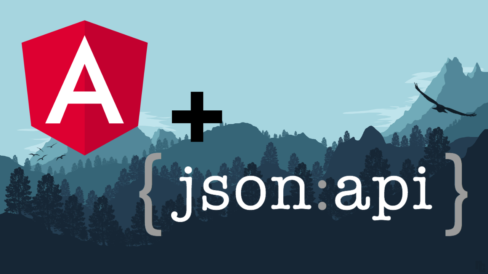
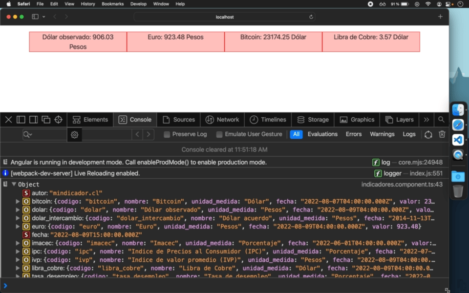

# Angular + consumo de API externa

[](https://www.youtube.com/watch?v=MRyky6n0ek0)

Ver aplicación resultado: https://repo.coppiloto.com/angular-indicadores/

[Ver paso a paso en Youtube](https://www.youtube.com/watch?v=MRyky6n0ek0) (38 min)

- [00:00](https://www.youtube.com/watch?v=MRyky6n0ek0&t=0s) ¿Qué se desarrollará? Visualizador Indicadores económicos diarios usando la API de mindicador.cl
- [00:34](https://www.youtube.com/watch?v=MRyky6n0ek0&t=34s) Instalación de programas necesarios: Nodejs (npm), Angular CLI, VS Code (Pack de extensiones **Coppiloto**)
- [02:23](https://www.youtube.com/watch?v=MRyky6n0ek0&t=143s) Creación de aplicación web `ng new` y ejecución local `ng s -o`
- [06:08](https://www.youtube.com/watch?v=MRyky6n0ek0&t=368s) Exploración de API abierta de mindicador.cl
- [08:13](https://www.youtube.com/watch?v=MRyky6n0ek0&t=493s) Instalación de Bootstrap en Angular
- [12:31](https://www.youtube.com/watch?v=MRyky6n0ek0&t=751s) Creación de componente `ng g c nombre-componente` para separar lógica
- [16:26](https://www.youtube.com/watch?v=MRyky6n0ek0&t=986s) Inyección de HttpClient para traer los datos de la API
- [21:13](https://www.youtube.com/watch?v=MRyky6n0ek0&t=1273s) Renderizar variables (.ts) de clase en vista (.html)
- [22:28](https://www.youtube.com/watch?v=MRyky6n0ek0&t=1348s) Creación de Interface (representación de estructura de dato) usando extensión "JSON to TS"
- [25:24](https://www.youtube.com/watch?v=MRyky6n0ek0&t=1524s) Renderizar en pantalla el objeto/propiedad (JSON) de cada indicador
- [34:20](https://www.youtube.com/watch?v=MRyky6n0ek0&t=2060s) Retoques visuales finales

[](https://www.youtube.com/watch?v=MRyky6n0ek0)

## Comandos

Clonar y correr proyecto localmente

```bash
git clone https://github.com/miguel-coppiloto/angular-indicadores.git
cd angular-indicadores
npm install
ng serve --open
```

Crear y correr proyecto en blanco

```bash
ng new angular-indicadores
cd angular-indicadores
ng serve --open
ng s -o # versión corta
```

Instalación de [Bootstrap](https://getbootstrap.com/docs/5.2/getting-started/introduction/) (para uso de estilos CSS) editar `angular.json` y agregar en el nodo `projects > [name-project] > architect > build > options > style`

```bash
"styles": [
  "node_modules/bootstrap/scss/bootstrap.scss",
  "src/styles.scss"
],
```

Para la creación del componente

```bash
ng generate component componente/indicadores
ng g c componente/indicadores # versión corta
```

Compilación para subida a servidor

```bash
ng build --configuration production --base-href /angular-indicadores/
```

---

🌱 Repositorio: https://github.com/miguel-coppiloto/angular-indicadores

🌱 Pack de extensiones Coppiloto: https://marketplace.visualstudio.com/items?itemName=coppiloto.extension-package-for-ionic

🌱 Contacto: miguel@coppiloto.com
